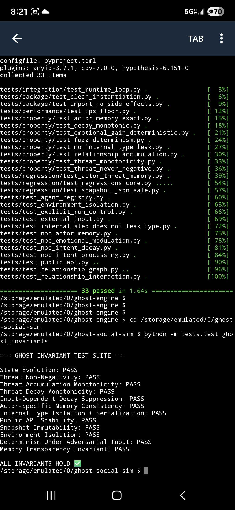
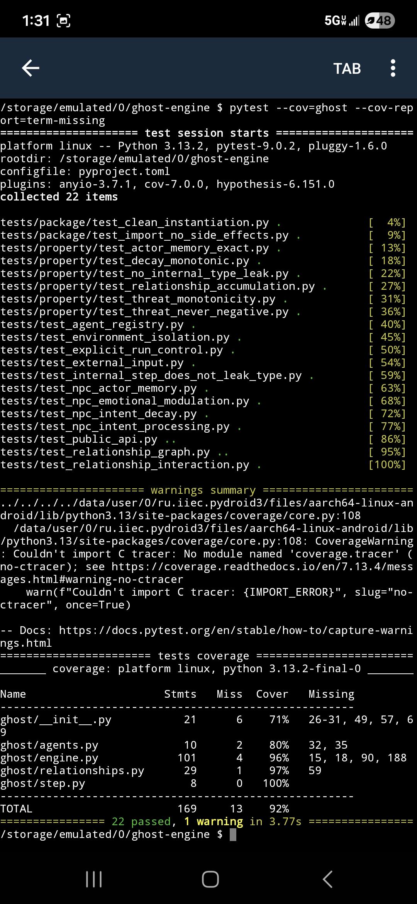
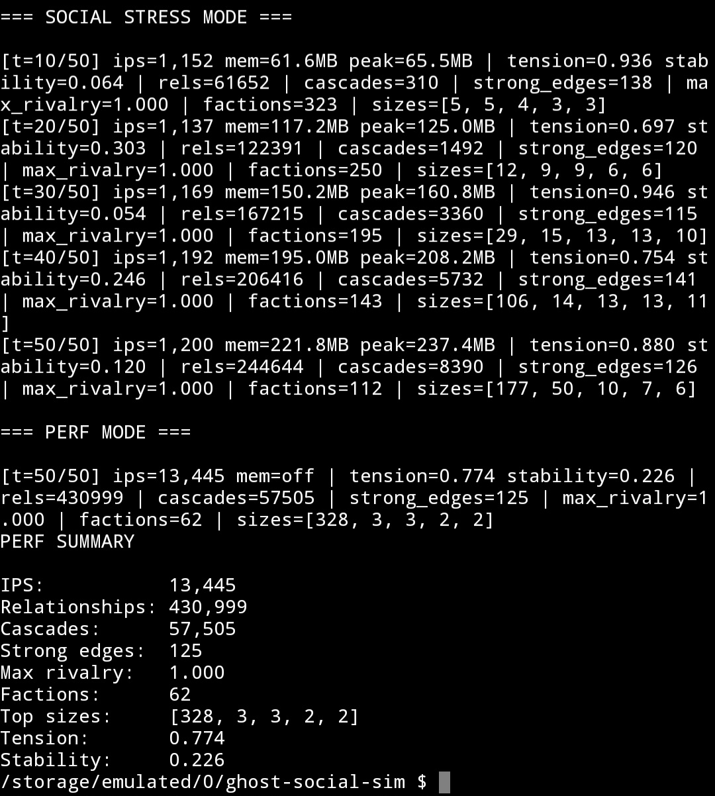

# Testing & Validation

This document outlines the testing strategy and validation evidence for the Ghost Engine runtime.

The goal of these tests is to verify:

- correctness of state evolution
- stability under load
- emergent behavior consistency
- runtime scalability
- memory safety under stress

---

# Test Overview

Ghost Engine is validated using three layers:

1. **Invariant Tests** – correctness + stability guarantees  
2. **Coverage & Pass Evidence** – runtime verification proof  
3. **Stress Benchmarks** – scalability + emergence testing  

---

# 1. Invariant Testing

Invariant tests validate core runtime guarantees across ticks and interactions.

Covered behaviors:

- bounded affect values  
- stable relationship evolution  
- safe decay behavior  
- no invalid state transitions  
- consistent tick progression  

Files:

```
tests/test_ghost_invariants.py
tests/bench_runtime_stress.py
```

---

# 2. Coverage & Execution Evidence

## Pytest Results



## Coverage Results



These confirm runtime correctness across tested surfaces.

---

# 3. Runtime Stress Benchmark

The runtime was tested under sustained high-load interaction scenarios to validate:

- scaling behavior  
- emergent faction formation  
- cascade propagation  
- runtime stability  

## Benchmark Configuration

- Device: Pixel 6a (Termux)  
- Agents: 5,000  
- Interactions: 10,000 per tick  
- Duration: 50 ticks  

## Results



Observed:

- ~13.4k interactions/sec sustained  
- ~430k relationships active  
- stable large-cluster emergence  
- consistent cascade propagation  

The runtime remained stable throughout execution with no failures.

---

# Conclusion

These tests demonstrate that Ghost Engine:

- maintains stable evolution under heavy load  
- scales efficiently across large agent populations  
- produces consistent emergent structures  
- remains safe across extended runtime execution  

Together, they provide strong validation of runtime correctness and performance.
